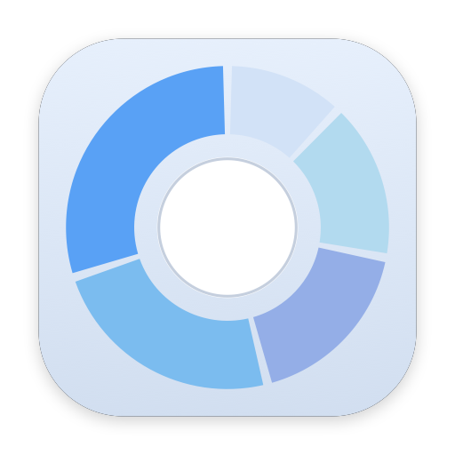
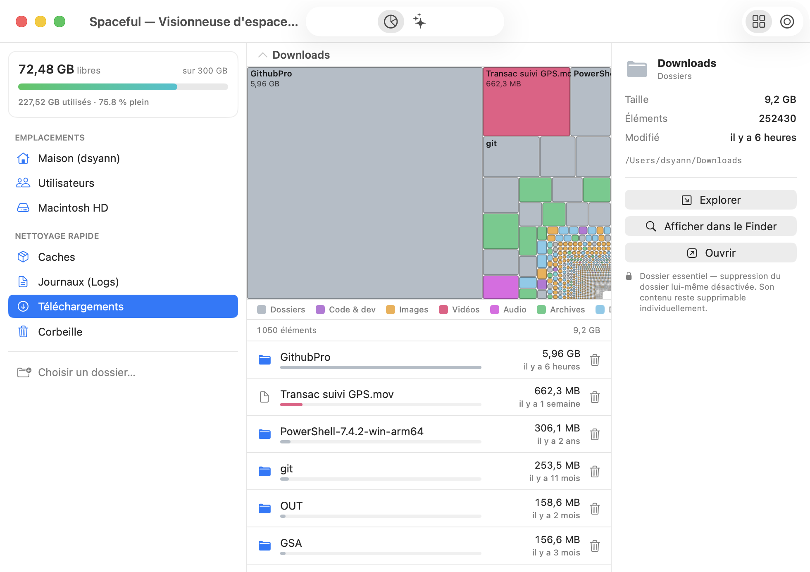
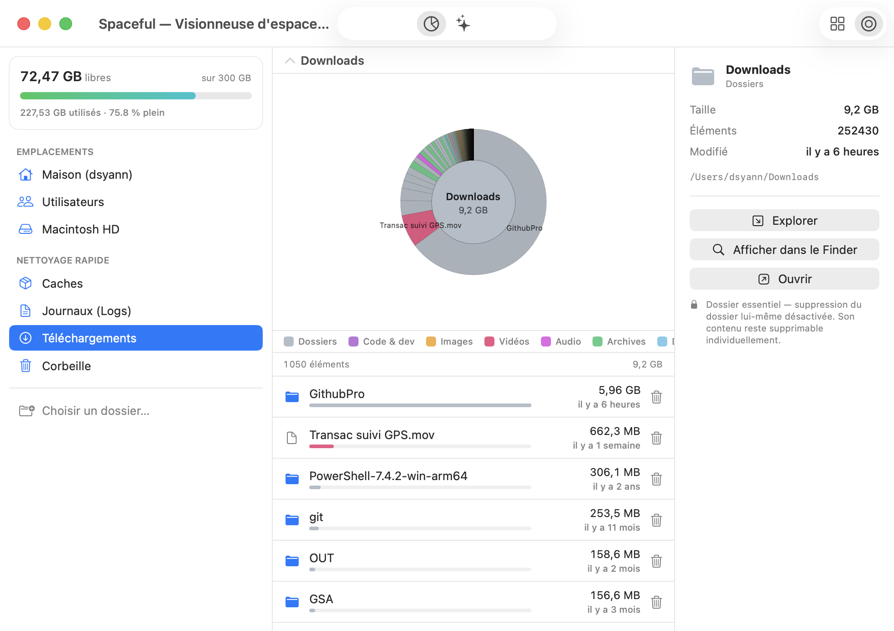

<p align="center">
  
</p>

<h1 align="center">Spaceful</h1>

<p align="center"><em>Visionneuse et nettoyeur d'espace disque, natif macOS.</em></p>

<p align="center">
  <a href="https://github.com/yannds/spaceful/releases/latest"><strong>⬇️ Télécharger l'app (.app, macOS 13+)</strong></a>
</p>

Application macOS native (SwiftUI) qui analyse un Mac, **visualise** ce qui occupe
l'espace (treemap + diagramme soleil, couleur par type de fichier), permet de **naviguer**
jusqu'au fichier fautif, et propose un **nettoyage** ciblé (caches, doublons par contenu,
fichiers anciens/volumineux, artefacts de dev). Toute suppression passe par la **corbeille**
(récupérable, avec **Annuler**) après confirmation — et **jamais** sur un chemin système.

## Captures

| Treemap (couleur par type) | Diagramme soleil |
|---|---|
|  |  |

## Lancer

```bash
./build.sh            # compile en release et produit Spaceful.app (avec icône)
open Spaceful.app
```

Développement rapide :

```bash
swift build              # compilation debug
swift run Spaceful       # exécution directe (sans bundle)
open -a Spaceful ~/Downloads          # ouvrir un dossier précis au lancement
SPACEFUL_OPEN=~/Downloads ./Spaceful.app/Contents/MacOS/Spaceful   # idem via variable d'env
```

> `Spaceful <chemin>` (argument) ou `SPACEFUL_OPEN=<chemin>` ouvre directement ce dossier ;
> `SPACEFUL_VIZ=sunburst` choisit le diagramme soleil au démarrage. Pratique pour
> « ouvrir avec », les scripts et les captures automatisées.

L'icône est générée par un script pur CoreGraphics, sans dépendance :

```bash
swift tools/make-icon.swift                              # → Spaceful.iconset + docs/icon-preview.png
iconutil -c icns Spaceful.iconset -o Spaceful.icns       # → Spaceful.icns
```

## Permissions — accorder l'accès une seule fois

macOS (TCC) demande l'autorisation **dossier par dossier** pour les zones protégées.
Pour l'éviter, accordez **une seule fois** l'**Accès complet au disque** :

1. L'app affiche une bannière « Accordez l'Accès complet au disque — une seule fois ».
2. Bouton **Ouvrir les Réglages** → ajoutez/activez `Spaceful` dans la liste.
3. Revenez sur l'app : elle re-vérifie automatiquement, la bannière disparaît, plus aucun
   prompt.

> **Que l'autorisation survive aux recompilations** : une signature ad-hoc change à
> chaque build, donc macOS réinitialise l'accès. Lancez **une fois** :
>
> ```bash
> ./tools/create-signing-identity.sh   # crée une identité auto-signée stable
> ./build.sh                            # signe avec elle automatiquement
> ```
>
> L'app garde alors la même « designated requirement » d'un build à l'autre : accès
> accordé une fois = valable pour toujours.

## Architecture

Séparation stricte des responsabilités — un type par fichier, aucune logique métier
dans les vues.

```
Sources/Spaceful/
├── App.swift                 Point d'entrée @main, injection de l'AppModel
├── Models/                   Données + logique métier (zéro import SwiftUI sauf AppModel)
│   ├── FileNode.swift        Nœud de l'arbre (chargé paresseusement, taille agrégée)
│   ├── ScanEngine.swift      Navigation paresseuse + dimensionnement progressif en fond
│   ├── DirectorySizer.swift  Calcul de taille d'un sous-arbre (1 passe) + cache thread-safe
│   ├── Analyzer.swift        Analyse de nettoyage indépendante (5 catégories, 1 passe)
│   ├── AnalyzerConfig.swift  Tous les seuils réglables (aucun magic number)
│   ├── DiskSpace.swift       Capacité/espace libre du volume (jauge en tête)
│   └── AppModel.swift        État partagé (@MainActor) : focus, sélection, lot, undo
├── Views/                    Vues SwiftUI pures, pilotées par l'AppModel
│   ├── ContentView.swift     Mise en page 3 colonnes + onglets + alertes + clavier + toast
│   ├── SidebarView.swift     Jauge disque + présélections + progression
│   ├── DiskGaugeView.swift   Jauge « X libres sur Y » colorée par taux d'occupation
│   ├── TreemapView.swift     Treemap « squarified » (Canvas), couleur par type, info-bulle
│   ├── SunburstView.swift    Diagramme soleil concentrique (Canvas), couleur par type
│   ├── VizLegend.swift       Légende des couleurs par catégorie de fichier
│   ├── DetailListView.swift  Liste triée par taille du dossier courant
│   ├── Breadcrumb.swift      Fil d'Ariane de navigation
│   ├── InspectorView.swift   Détails + actions (verrou sur chemins protégés)
│   ├── ToastView.swift       Confirmation transitoire avec Annuler (undo)
│   └── SuggestionsView.swift Onglet « Nettoyage » : cases à cocher + suppression par lot
└── Utilities/                Helpers transverses, sans état
    ├── Formatting.swift       Octets / dates relatives / pourcentages
    ├── ByteUnits.swift        Littéraux lisibles (200.MB, .days(365))
    ├── AtomicFlag.swift       Verrou booléen pour l'annulation de scan
    ├── FileActions.swift      Effets de bord fichiers (corbeille, restauration, Finder)
    ├── SystemPaths.swift      Protection des chemins système/essentiels (anti-suppression)
    ├── FileCategory.swift     Classification par type + palette + légende
    └── ScanTargets.swift      Emplacements prédéfinis à analyser
```

### Principes appliqués

- **MVVM** : les vues n'observent que `AppModel` ; aucun accès direct au système de
  fichiers depuis une vue (tout passe par `FileActions` / `ScanEngine`).
- **Single Responsibility** : un fichier = un type = une responsabilité.
- **Navigation paresseuse + progressive** : ouvrir un dossier est instantané (listing
  immédiat) ; les tailles des sous-dossiers sont calculées en parallèle en tâche de fond
  et publiées au fil de l'eau. On ne parcourt que ce qui est ouvert ; les résultats sont
  mis en cache.
- **Analyse indépendante** : l'`Analyzer` parcourt le disque sur sa propre file, en
  parallèle de la navigation, sans jamais la bloquer (le « scan heuristique à côté »).
- **Concurrence isolée** : tout le travail lourd s'exécute hors du thread principal et ne
  publie qu'via `@Published` ; l'UI ne bloque jamais.
- **Sécurité d'abord** : suppression = corbeille uniquement, jamais de `rm` définitif,
  toujours derrière une confirmation.
- **Configurabilité** : seuils de détection centralisés et injectables
  (`AnalyzerConfig`), ce qui les rend testables.
- **Aucun magic number** dans la logique : exprimé via `ByteUnits` et `AnalyzerConfig`.

## Sécurité & expérience

- **Chemins protégés** : `SystemPaths` interdit toute suppression (et toute suggestion)
  des sous-arbres système (`/System`, `/usr`, …) et des conteneurs essentiels (`/Users`,
  dossier maison, `~/Library`, …). Le bouton Corbeille est remplacé par un cadenas + raison.
- **Nettoyage par lot** : cases à cocher par élément/groupe, « Tout sélectionner », et une
  **seule** confirmation récapitulant nombre + taille.
- **Annuler (undo)** : après une mise à la corbeille, un toast « X libérés — Annuler »
  restaure les fichiers à leur emplacement d'origine.
- **Doublons par contenu** : taille → empreinte partielle → **hash complet**, donc deux
  fichiers au contenu identique sont détectés même sous des noms différents (zéro faux positif).
- **Visualisation par type** : couleur = catégorie de fichier (Photos, Vidéos, Code…),
  avec légende, info-bulles au survol, texte à contraste adaptatif.
- **Jauge d'espace disque** en tête de barre latérale (libres / utilisés).
- **Clavier** : ↑/↓ sélection, ⌘↓ explorer, ⌘↑ remonter, ⌘⌫ corbeille.
- **Accessibilité** : treemap et soleil exposent un élément VoiceOver par tuile/secteur.

## Pistes d'évolution

- Vues « Par type de fichier » et « Les plus gros fichiers » (plates, triables).
- Recherche / filtre (par taille, nom, extension, ancienneté).
- Persistance d'un cache de scan pour réouverture instantanée.
- Tests unitaires sur `Analyzer` et sur l'algorithme de treemap.
- Notarisation Apple pour distribution hors App Store.

## Licence

MIT — voir [LICENSE](LICENSE).
